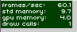
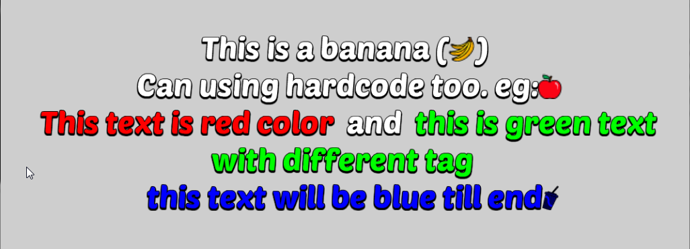

# Starling TextMesh
A Customable TextField for starling with 1 DrawCall.

 


### Feature
* Using BitmapFont along with custom icon (```<sprite="2"> ``` or ```IconID.getIcons("texture_name")```)
* Change color inline (html style) (```<color=#ff0000>red</color>``` or ``` <#ff0000>red</color> ```


### How to use:
* The texture for BitmapFont and Icon must be in the same TextureAtlas
* Use the Python executeable helper in helper folder to make a .fnt and IconID.as Class from icons.xml file
* Then finally place the file to bin folder. File that needed : font.png, font.xml, icons.fnt, [any font].fnt .

>**Important!**  
:exclamation: in **icons.fnt** file, ```size```, ```lineHeight``` and ```base``` attribute must follow the **Main** font attribute :exclamation:

**Source Example**

```as3
var fontAtlas:TextureAtlas = assetManager.getTextureAtlas("font");
var textMeshFont:TextMeshFont = new TextMeshFont(fontAtlas.getTexture("poetsen"), assetManager.getXml("poetsen"));
textMeshFont.parseIconFontXml(fontAtlas.getTexture("icons"), assetManager.getXml("icons"),"poetsen");

// Starling 1.x
TextMesh.registerBitmapFont(textMeshFont, "poetsen");
// Starling 2.x
TextMesh.registerCompositor(textMeshFont, "poetsen");
			
var text:String = "This is a banana (" + IconID.getIcons("banana") + ")\n" +
				  "Can using hardcode too. eg:<sprite=\"1\">\n" +
				  "<color=#ff0000>This text is red color</color> and " + 
                  "<#00ff00>this is green text with different tag</color>\n" +
				  "<#0000ff> this text will be blue till end" + 
                  IconID.getIcons("soda");

// Starling 1.x
var textField:TextMesh = new TextMesh(1024, 400, text , "poetsen", 46, 0xffffff);
// Starling 2.x
var textField:TextMesh = new TextMesh(1024, 400, text , new TextFormat("poetsen", 46, 0xffffff));
textField.alignPivot();
textField.x = 512;
textField.y = 300;
this.addChild(textField);
```
### Future work:
* Rich Text Format
* Multiple Font
* Multiple Font Size


### ------------------------
Any Suggestion or facing a problem, can ask me at *[mchen0358@gmail.com]()*
